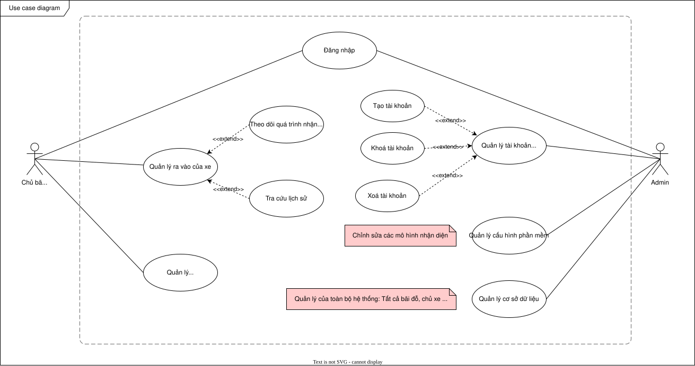

# E-PARKING – HỆ THỐNG BÃI ĐỖ XE THÔNG MINH

## Tổng quan dự án

Hệ thống E-Parking được phát triển nhằm giải quyết các vấn đề thường gặp tại bãi đỗ xe truyền thống như:
- Thiếu minh bạch trong quản lý.
- Khó khăn trong việc kiểm soát ra vào xe và thu phí tự động.
- Không có khả năng tự động hóa việc tính phí, lưu trữ dữ liệu, và nhận dạng

Dự án này hướng đến việc xây dựng một hệ thống bãi đỗ xe thông minh toàn diện, ứng dụng công nghệ AI để mang lại trải nghiệm tiện lợi, chính xác và an toàn hơn.

Mục tiêu của dự án là xây dựng một hệ thống **bãi đỗ xe thông minh** với khả năng:
- **Nhận diện biển số xe** tự động qua camera.
- **Bảo mật thông minh** thông qua nhận diện khuôn mặt.
- **Theo dõi thời gian đỗ xe** chính xác.
- **Tính phí tự động** minh bạch, tiện lợi.
- **Quản lý người dùng và xe ra vào** theo thời gian thực.

## Công nghệ sử dụng
- **Frontend**: ReactJS, Tailwind CSS.
- **Backend**: Python (FastAPI hoặc Flask).
- **AI & Xử lý ảnh**: OpenCV, Deepface, Yolo.
- **Database**: SQLite.
- **DevOps**: Docker, Docker Compose.
- **Phần cứng**: Camera máy tính hoặc camera điện thoại.
## Sơ đồ Use Case

## Tính năng chính
- **Nhận diện biển số xe và khuôn mặt** bằng camera tự động.
- **Ghi nhận thời gian xe vào và ra** để tính phí chính xác.
- **Tính phí đỗ xe tự động** theo khung giờ định sẵn.
- **Giao diện web** cho người dùng và quản trị viên.
- **Báo cáo và thống kê** lượt xe, doanh thu theo thời gian.

## Kiến trúc hệ thống (tổng quan)
- **Client** (Web): Giao diện người dùng.
- **Server Backend**: Quản lý logic nghiệp vụ.
- **Server Backend-AI**: Xử lý AI.
- **Database**: Lưu trữ thông tin người dùng, lịch sử xe ra vào, thông tin thanh toán.
- **Camera**: Nhận diện biển số xe (có thể dùng từ điện thoại hoặc webcam).

## Đối tượng sử dụng
- Chủ bãi đỗ xe sử dụng phần mềm.
- Quản trị viên cung cấp phần mềm.

## Set up hệ thống

### Thiết lập Camera

#### Yêu cầu phần cứng
- 2 webcam:
  - Đối với máy tính để bàn: Cần 2 webcam gắn ngoài.
  - Đối với laptop: 1 webcam tích hợp + 1 webcam gắn ngoài là đủ.

#### Nếu không đủ webcam
- Sử dụng điện thoại Android/iOS làm webcam bằng cách thực hiện các bước sau:

##### Cài đặt ứng dụng cần thiết
- Trên Android/iOS: Cài đặt *DroidCam* từ Google Play Store/App Store.
- Trên máy tính: Tải và cài đặt *DroidCam Client* từ trang web chính thức: https://www.dev47apps.com/

##### Kết nối cả hai thiết bị
- Đảm bảo điện thoại và máy tính được kết nối với cùng một mạng Wi-Fi.
- Mở ứng dụng *DroidCam* trên điện thoại và ghi lại địa chỉ IP (Wi-Fi) được hiển thị.
- Mở *DroidCam Client* trên máy tính, nhập địa chỉ IP (Wi-Fi) và cổng từ điện thoại, sau đó nhấp vào *Start*.

##### Kiểm tra kết nối
- Nếu thành công, điện thoại của bạn sẽ hoạt động như một webcam và có thể được sử dụng thay thế cho webcam vật lý.

## Tài khoản kiểm thử

### Quản trị viên
- Tên đăng nhập: admin
- Mật khẩu: 123

### Người dùng
- Tên đăng nhập: minmin
- Mật khẩu: 123

## Thiết lập Docker, hướng dẫn chạy
- Liên kết kho Docker Hub https://hub.docker.com/u/xyzhuy

- Chạy lệnh các lệnh sau để pull images
```bash
docker pull xyzhuy/frontend
docker pull xyzhuy/backend
docker pull xyzhuy/backend-ai
```
- Đối với Mac, nếu các lệnh trên không pull images về được, chạy các lệnh sau
```bash
docker pull --platform linux/amd64 xyzhuy/frontend
docker pull --platform linux/amd64 xyzhuy/backend
docker pull --platform linux/amd64 xyzhuy/backend-ai
```

Chạy lệnh sau để khởi động hệ thống
```bash
docker-compose up -d
```

Truy cập http://localhost:5173/ để truy cập frontend

## Thành viên tham gia xây dựng hệ thống

-Trịnh Tuấn Ngọc Bảo (23020333)

-Vũ Đức Minh (23020401)

-Vũ Đức Huy (23020380)

-Phan Trần Mạnh Cường (23020339)

-Nguyễn Vũ Quang Anh (23020329)
